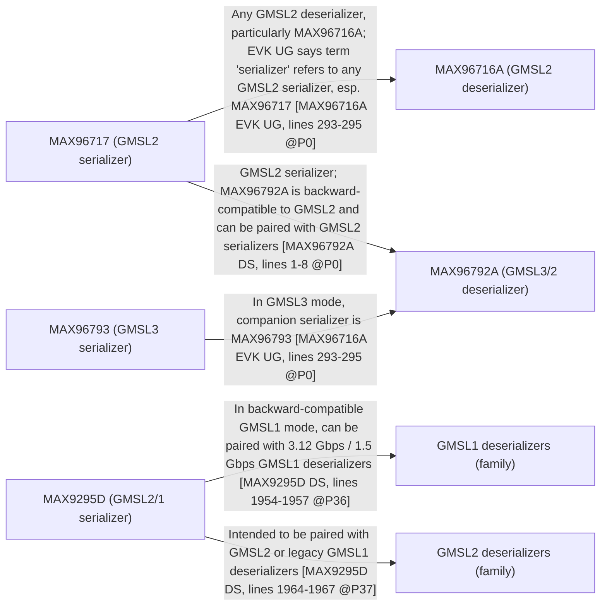

# GMSL Serializers and Deserializers

GMSL is a coax cable that is one high speed data pipe. SerDes multiplex multiple kinds of information over this pipe.

1. control channel
2. data channel
3. mfp gpio channel
4. backchannel

These are just bitstreams that go on the same medium. 

Control Channel: i2c or uart used to configure registers on the camera.
Data channel: csi video
mfp gpio channel: sending gpio pin states 
backchannel: since the link is bidirectional, this thing carries info back (e.g. strobe pins for informing when the camera trigger was activated)

Here’s what I can do for you **right now** and what’s in the attached bundle.

---

### 1. Practical limitation (so expectations are sane)

I’m running in a sandbox that has no direct internet access for file downloads, so I **cannot pull the actual PDF datasheets themselves into a zip**.

What I *can* and *did* do:

* Collected the **official datasheet / user-guide URLs** for the parts.
* Built a **Mermaid bipartite-style graph** showing which serializers can pair with which deserializers, with **per-edge doc references (page + line ranges from the scraped text)**.
* Packaged all of that into a zip you can download.

You can then run a script locally to fetch the PDFs using the URLs if you want a “real” datasheet archive.

---

### 2. Downloadable zip

I’ve created a zip with:

1. `datasheet_urls.txt` – list of parts and their datasheet / documentation URLs.
2. `gmsl_compat_mermaid.md` – Mermaid graph code for your bipartite graph.
3. `gmsl_compat_edges_sources.txt` – human-readable list of edges with page/line references.

👉 **[Download the zip](sandbox:/mnt/data/gmsl_serdes_graph_bundle.zip)**

---

### 3. Mermaid graph (inline for quick use)

You can paste this directly into any Mermaid-enabled viewer:

---

### 4. Where each edge comes from (page / line refs)

These are also inside `gmsl_compat_edges_sources.txt` in the zip, but summarizing here:

1. **MAX96717 → MAX96716A** (GMSL2 serializer → GMSL2 deserializer)
   *Doc:* **MAX96716A EVK User Guide**
   *Evidence:* Intro text: the EVK uses MAX96716/MAX96792 with a GMSL2 serializer, and *“the term serializer refers to any GMSL2 serializer device, particularly the MAX96717.”*
   *Ref:* `max96716a-evkug-00.pdf`, lines 293–295 @ page P0.

2. **MAX96717 → MAX96792A** (GMSL2 serializer → dual GMSL3/2 deserializer)
   *Doc:* **MAX96792A datasheet – General Description**
   *Evidence:* “The MAX96792A … is backward compatible with GMSL2 and can be paired with 6Gbps or 3Gbps GMSL2 serializers.” (lines 1–8 @ P0)
   *Ref:* `max96792a.pdf`, lines 1–8 @ page P0.

3. **MAX96793 → MAX96792A** (GMSL3 serializer → dual GMSL3/2 deserializer)
   *Doc:* **MAX96716A EVK User Guide**
   *Evidence:* Same intro section mentions that when MAX96792A is used in **GMSL3** mode, *the companion serializer is MAX96793.*
   *Ref:* `max96716a-evkug-00.pdf`, lines 293–295 @ page P0.

4. **MAX9295D → GMSL1 deserializers (family)**
   *Doc:* **MAX9295D datasheet**
   *Evidence:* “In backward-compatible GMSL1 mode, the MAX9295D can be paired with 3.12Gbps or 1.5Gbps GMSL1 deserializers…” (lines 1954–1957 @ P36 and also lines 5–7 @ P0).
   *Ref:* `max9295d.pdf`, lines 1954–1957 @ page P36, lines 5–7 @ page P0.

5. **MAX9295D → GMSL2 deserializers (family)**
   *Doc:* **MAX9295D datasheet**
   *Evidence:* Same section continues: “…or operate up to 4.5Gbps with GMSL2 deserializers in GMSL1 mode.” and later “The MAX9295D is intended to be paired with GMSL2 deserializers or legacy GMSL1 deserializers.” (lines 1964–1967 @ P37).
   *Ref:* `max9295d.pdf`, lines 1954–1957 @ page P36 and 1964–1967 @ page P37.

---

### 5. Parts / URLs included in `datasheet_urls.txt`

From the zip:

* **MAX96716A Deserializer (EVK UG)**
  `https://www.analog.com/media/en/technical-documentation/user-guides/max96716a-evkug-00.pdf`

* **MAX96717 Serializer (GMSL2 CSI-2)**
  `https://www.analog.com/media/en/technical-documentation/data-sheets/max96717.pdf`

* **MAX96792A Dual GMSL3/2 to CSI-2 Deserializer**
  `https://www.analog.com/media/en/technical-documentation/data-sheets/max96792a.pdf`

* **MAX96793 GMSL3 Serializer**
  `https://www.analog.com/media/en/technical-documentation/data-sheets/max96793.pdf`

* **MAX9295D GMSL2/1 Dual CSI-2 Serializer**
  `https://www.analog.com/media/en/technical-documentation/data-sheets/max9295d.pdf?isDownload=true`

* **MAX9296A Deserializer (no public datasheet)**
  No public DS; I included a reference EngineerZone thread:
  `https://ez.analog.com/video/f/q-a/587830/max96724-replacing-max9296a`

MAX9296A compatibility is therefore hard to encode rigorously in the graph because the evidence comes from app notes, design guides, and forum posts rather than a freely available datasheet.

---

If you want, next step I can extend this to a bigger matrix (e.g., add MAX96724, more GMSL1 parts) and show you how to auto-generate the Mermaid from a CSV so you can grow the graph as you add parts.
